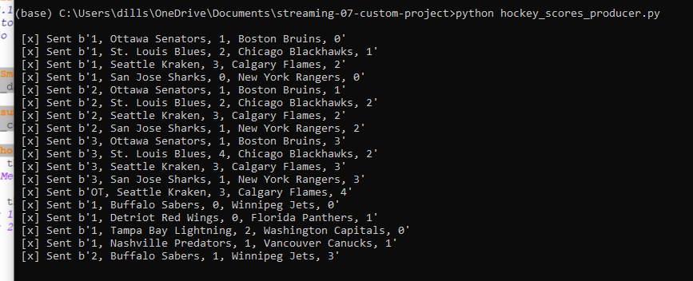
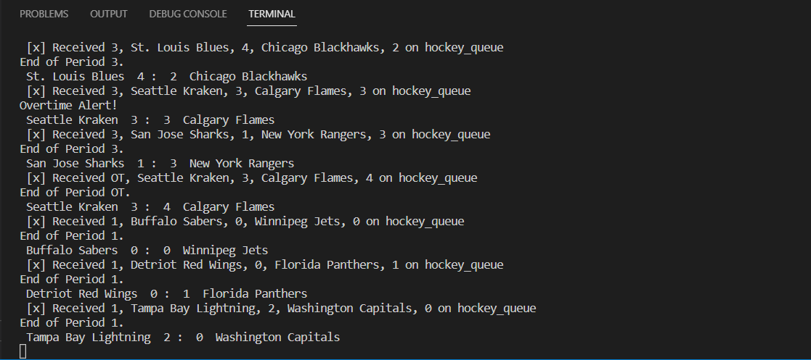

# streaming-07-custom-project

## Hockery Score Alerts

This project takes end of period scores and produces a message to send those scores via a producer. A consumer then takes those messages and turns them into end of period alerts. If a game is heading into overtime, an special alert will be produced. I follow a ton of sports and would love to be able to customize alerts more than you can on many applications. This is a start to building something larger in the future.

This can be updated in the future to hook to an api that a sports network may provide. In reality these scores would come through as periods end live. In this example, we send a score every 30 seconds.

## Prerequisites
* Python 3.10 or newer installed
* Ability to execute python scripts

## Data Source
hockey_scores.csv
This was manually created to simulate a night of hockery with early and late starting games.

## Stream End of Period Score
Run hockey_scores_producer.py to simulate a stream of hockey scores data every 30 seconds.

## Use consumer to read the data and show alerts
Run hockey_scores_consumer.py in a new terminal as hockey_scores_producer.py is running

## Future considerations
* Text alerts
* API to run live scoring

## Screenshots
This shows the producer running and sending messages

This shows the consumer receiving the data and using to show alerts
